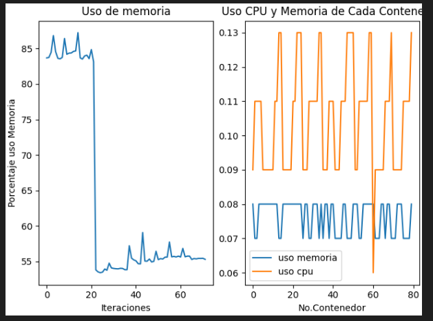

# Manual Tecnico
# Proyecto 1 Sistemas Operativos 1

## **Objetivos e Información del Sistema**

Este proyecto consiste en un módulo de linux para obtener información del sistema, contenedores hechos en docker, y un servicio en linux el cuál administra los contenedores de linux gracias a la información dada por el módulo en linux.

## Instalacion y modo de uso

### Inicializar Proyecto

Primero se debe instalar el módulo que obtendrá la información de los contenedores de docker. Este se encuentra en Proyecto1/modulo/

instalamos el módulo con el comando

```bash
sudo insmod basic.ko
```
Luego usamos el siguiente comando para ver si se instaló correctamente: 
```bash
sudo dmesg | tail -n 20 
```
Podremos ver el mensaje Modulo sysinfo cargado:


Luego para no correr el riesgo de saturar el sistema de contenedores, corremos el servicio de rust.

Nos dirijimos a /Proyecto1/container_service y colocamos el siguiente comando:

```bash
cargo run
```

Luego creamos el cronjob que creará los contenedores, nos dirijimos a /Proyecto1/scripts/ y colocamos el siguiente comando:

```bash
sudo ./crearCronjob.sh
```
Para comprobar si se creó el cronjob correctamente podemos comprobarlo con el siguiente comando:


## Cerrar Proyecto

Para finalizar el Proyecto, tendremos primero que eliminar el cronjob entrando a /Proyecto1/scripts/ y colocamos el siguiente comando:

```bash
sudo ./eliminarCronjob.sh
```
Para comprobar si se eliminó el cronjob correctamente podemos comprobarlo con el mismo comando usado antes:


luego terminaremos el servicio de rust llendo a la consola que lo ejecuta y presionando ctrl+c.


Podremos encontrar los logs generados en /Proyecto1/imagenLogs/logs/, y las graficas en /Proyecto1/imagenLogs/graphs/.

Logs generados:


Graficas:



## Partes del proyecto

### modulo

Este consiste en un módulo para linux creado en c el cuál con la estructura task_struct consigue la información del sistema de memoría y de contenedores, y la escribe en el archivo /proc/sysinfo_202010044.


### Contenedores docker

Posee 2 contenedores de docker de alto y 2 de bajo consumo distintos, hechos en python:

### Scripts

- crearCronjob.sh: Genera el cronjob para crear contenedores cada minuto, necesita sudo para su correcto funcionamiento.

- eliminarCronjob.sh: Elimina el cronjob creado con crearCronjob.sh, necesita sudo para su correcto funcionamiento.

- generarCon.sh: El script llamado por el cronjob que creará aleatoriamente 10 contenedores de las 4 imagenes de alto y bajo consumo creadas en el proyecto.

### Contenedor imagenLogs

Contenedor hecho en python para el registro de logs de el servicio de rust, y creación de gráficas.

Backend hecho con fast api, graficas hechas con matplotlib.

### Servicio en rust

Servico el cual obtiene la información de /proc/sysinfo_202010044 y administra los contenedores. Envia las información obtenida al contenedor imagenLogs para logs y graficas.

